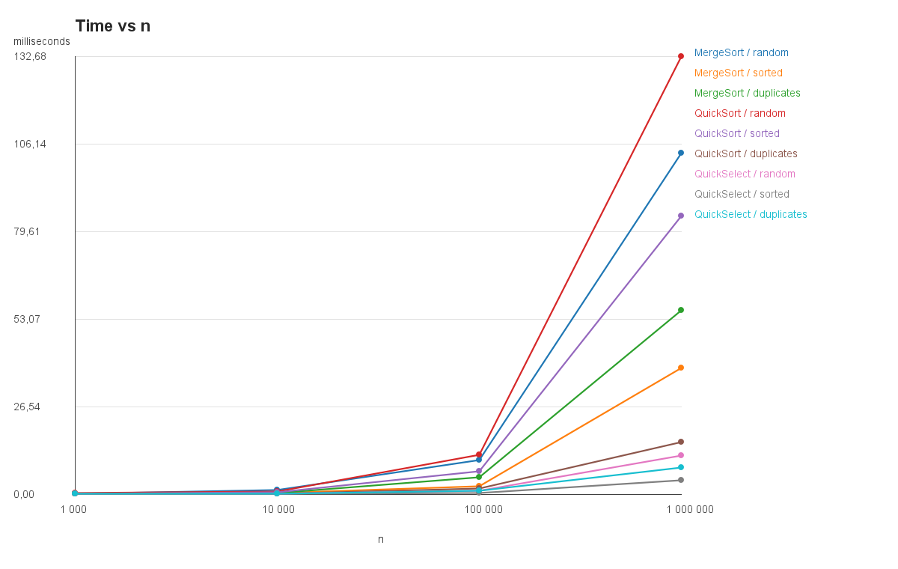
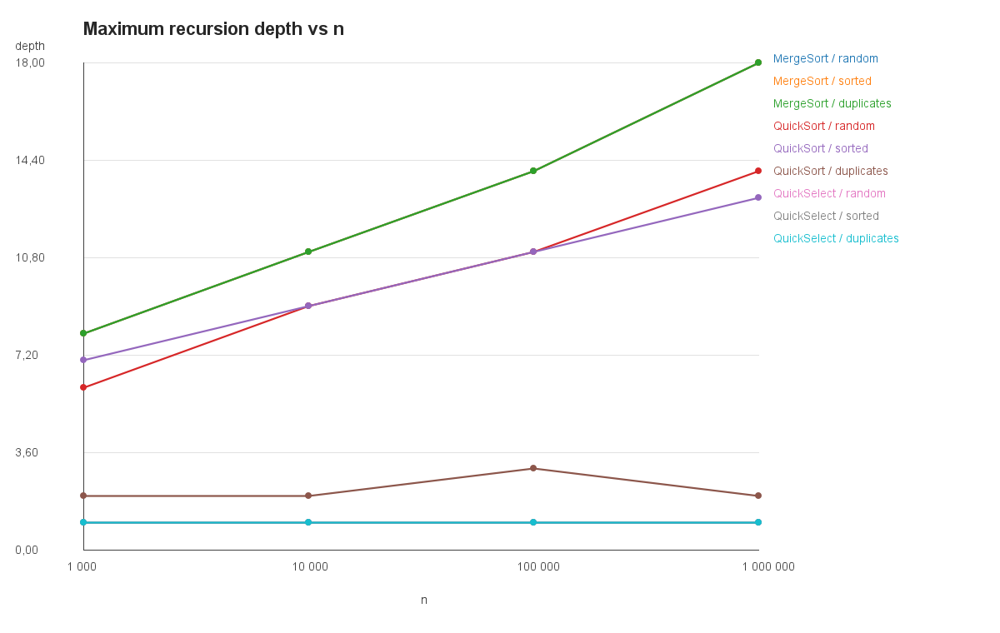
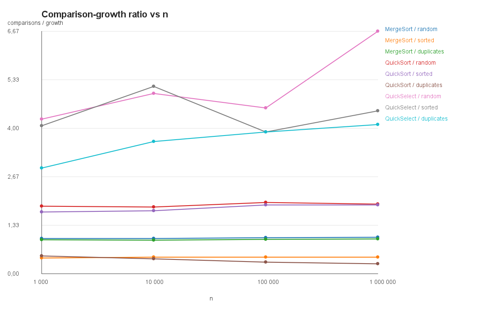

# Assignment 1: Divide and Conquer

## Implemented design

MergeSort uses one reusable helper buffer allocated by its public method. Its recursive calls use insertion sort for partitions of at most 15 elements, reducing call overhead on small ranges. QuickSort chooses a random pivot and uses a Dutch-national-flag partition. It recurses on the smaller partition only and processes the larger partition in a loop, keeping the call stack bounded even when a pivot split is poor. QuickSelect reuses that partition but iterates only over the partition that contains `k`.

## Asymptotic bounds

| Algorithm | Best case | Average case | Worst case |
|---|---|---|---|
| MergeSort | Θ(n log n): both halves are still visited | Θ(n log n): each level merges linear work | Θ(n log n): merge work is linear at every level |
| QuickSort | Θ(n log n): pivots split evenly | Θ(n log n): random pivots give balanced splits in expectation | Θ(n²): repeated extreme pivots create partitions of 0 and n-1 |
| QuickSelect | Θ(n): pivot immediately places k or removes a constant fraction | Θ(n): random pivots discard a constant fraction in expectation | Θ(n²): repeated extreme pivots discard one item |
| Insertion Sort | Θ(n): input is already sorted | Θ(n²): a typical unsorted input shifts quadratically many items | Θ(n²): reverse-sorted input shifts every prior item |

## Recurrences and Master Theorem

**MergeSort.** `T(n) = 2T(n/2) + Θ(n)`. Here `a = 2`, `b = 2`, and `f(n) = Θ(n)`. Since `n^(log_b a) = n`, this is Master Theorem case 2, so `T(n) = Θ(n log n)`.

**QuickSort with balanced partitions.** `T(n) = 2T(n/2) + Θ(n)`. Again `a = 2`, `b = 2`, and `f(n) = Θ(n)`, giving case 2 and `Θ(n log n)`. A random pivot does not guarantee a balanced split on a particular call, but every rank is equally likely. Across an execution this produces balanced-enough splits in expectation, so expected running time is `O(n log n)`.

**QuickSelect with balanced partitions.** `T(n) = T(n/2) + Θ(n)`. Here `a = 1`, `b = 2`, and `f(n) = Θ(n)`, while `n^(log_b a) = 1`. This is Master Theorem case 3, so `T(n) = Θ(n)`.

## Benchmark and plots

Run `mvn exec:java` to create `results.csv` and the plots below. Every row is the median time of five runs; comparison count and maximum recursion depth are taken from the same median-time run.

The sort ratios use `comparisons / (n log2 n)` and the QuickSelect ratios use `comparisons / n`. The plot provides an empirical Θ check. With `n0 = 10,000`, MergeSort on random data stays approximately between `c1 = 0.95` and `c2 = 1.00`, while QuickSort on random data stays approximately between `c1 = 1.80` and `c2 = 1.95`. QuickSelect's random-pivot ratio varies more on these five samples, from about `4.5` to `6.7`, but remains a constant-scale linear ratio rather than growing with n.

## Discussion

The measurements should match the expected growth rates: MergeSort and QuickSort grow close to `n log n`, while QuickSelect grows close to `n`. Duplicate-heavy arrays favor three-way QuickSort because all values equal to the pivot are discarded at once. MergeSort's cutoff improves small partitions because insertion sort avoids recursive and merge overhead. The first executions can be slower while the JVM loads classes and compiles hot methods. Garbage collection can cause isolated time spikes, especially for the largest arrays. Cache locality and memory bandwidth affect MergeSort because it copies elements through a buffer. Random pivoting makes QuickSort timings and comparisons vary slightly between runs, which is why the benchmark takes the median of five runs. The smaller-side-first rule keeps QuickSort's recorded recursion depth logarithmic even on sorted data.
